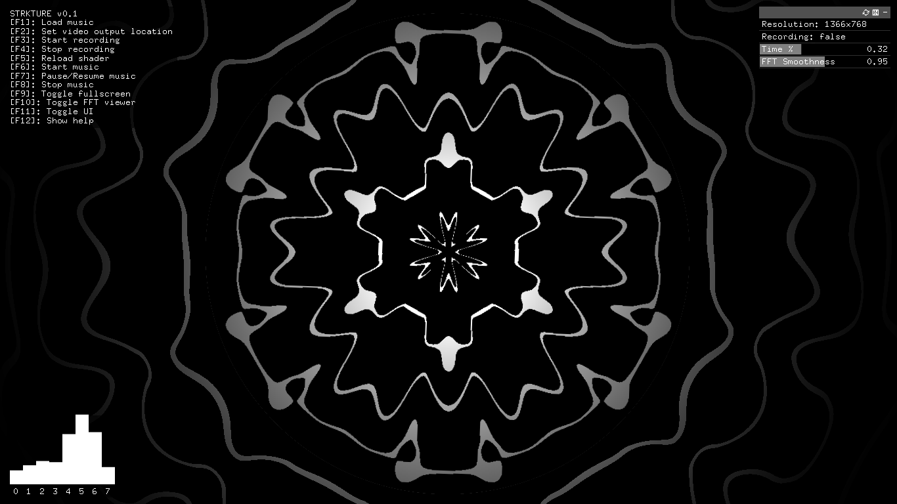

# Strkture
**Strkture** _(pronounced like **structure**)_ is a tool for creating music videos by recording the output of realtime GLSL shaders. The shaders can access properties like time, resolution and a simplified audio spectrum in order to make realtime audio visualizations.  

**Strkture** is built with [Open Frameworks](https://github.com/openframeworks/openFrameworks) and uses [FFmpeg](https://github.com/FFmpeg/FFmpeg) to export the output as a video. Open Frameworks is only requierd when building from source and FFmpeg is requierd for saving videos.

## Building from source
To build from source you need [Open Frameworks](https://github.com/openframeworks/openFrameworks).
Navigate to the main directory and run `make Release`. This will generate an executable binary in the `bin` directory, you can run the program either by running `make run` or by running the generated binary.

## Usage
First select the audio track by pressing `F1` and the video output location by pressing `F2`.  
Once you have selected the audio track and the video output location you can start recording by pressing `F3`. Only the shader output will be recorded so there is no need to hide the UI while recording. The recording will automatically stop once the track finishes. You can also stop recording prematurely by pressing `F4`.  
The template shaders are located at `bin/data/shaders`, you can modify the default shaders with an external editor and press `F5` to reload them without exiting Strkture.  
